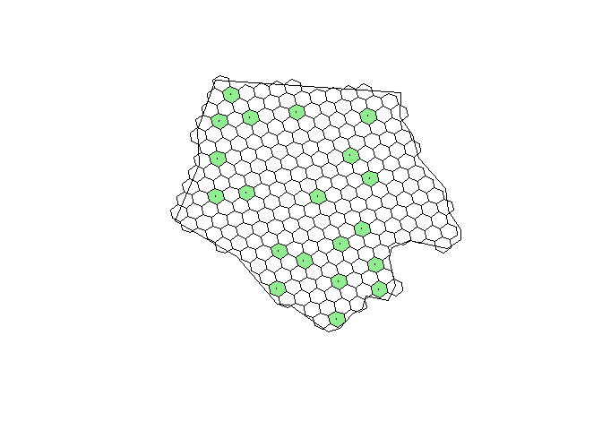

<!-- README.md is generated from README.Rmd. Please edit that file -->

<!-- badges: start -->

[](https://www.repostatus.org/#concept)
[](https://lifecycle.r-lib.org/articles/stages.html#experimental)
[](NA)
[](https://github.com/inbo/h3sampling/releases)

 


[](https://app.codecov.io/gh/inbo/h3sampling?branch=main)
[](https://extendr.github.io/extendr/extendr_api/)
<!-- badges: end -->

# h3sampling: Spatially Balanced Sampling from the H3 Discrete Global Grid System

[Van Calster, Hans](mailto:hans.vancalster%40inbo.be)[^1]

**keywords**: H3; GRTS; spatially balanced sampling

The `h3sampling` package implements spatially balanced sampling designs
which leverage the [H3](https://h3geo.org/) discrete global grid system
for indexing spatial data into a hexagonal grid. The package currently
only provides spatially balanced sampling via an adaptation of the
Generalized Random Tessellation Stratified (GRTS) algorithm. By making
use of the [H3](https://h3geo.org/) global grid, the package is
especially suitable for so-called master samples. For a given H3 grid
resolution and a given random seed, all H3 cells are deterministically
sorted such that consecutively ordered cells are spatially balanced
samples for a given area on earth.

The implementation is written in [`Rust`](https://rust-lang.org/) with
the aid of `rextendr`. Large language models Google Gemini pro and
Antropic Claude Sonnet 4.6 were used. The former for brainstorming and
code writing, the latter for a final critic and improvements on the code
base. R code is kept to a bare minimum and the package has zero R
dependencies. This results in a lightweight, cross-platform, fast and
memory friendly implementation.

<!-- description: start -->

Reproducible, lean and fast spatially balanced (master) sampling
leveraging the H3 discrete global grid system. <!-- description: end -->

## Installation

You can install the development version from
[GitHub](https://github.com/) with:

``` r
# install.packages("remotes")
remotes::install_git("https://github.com/inbo/h3sampling")
```

## Example

For an example, we extract Ashe county from the North Caroline state
dataset that ships with the `sf` package. We draw a spatially balanced
sample with the aid of `h3_grts()` at resolution 7 of the [H3
resolutions](https://h3geo.org/docs/core-library/restable/) system. This
corresponds to hexagonal areas of approximately 5.16 km². The `h3o`
package can be used to, among other things, obtain the hexagon centroid
or vertices.

``` r
library(h3sampling)
nc_path <- system.file("shape/nc.shp", package = "sf")
ashe <- sf::st_read(
  nc_path,
  quiet = TRUE,
  query = "SELECT * FROM nc WHERE NAME='Ashe'"
)
ashe_wkb <- ashe |>
  sf::st_geometry() |>
  sf::st_as_binary()
ashe_wkb <- ashe_wkb[[1]]
  
h3_sample <- h3_grts(
  wkb = ashe_wkb,
  n = 20,
  resolution = 7,
  containment = "centroid",
  seed = 123,
  area_correction = FALSE
)
h3_sample$geom_points <- h3_sample$cell |>
  h3o::h3_from_strings() |>
  h3o::h3_to_points()
h3_sample$geom_hexagons <- h3_sample$cell |>
  h3o::h3_from_strings() |> 
  h3o::h3_to_vertexes() |>
  sf::st_cast("POLYGON")
```

We can visualise the selected spatially balanced sample and the H3
cells:

``` r
ashe_cells <- h3o::sfc_to_cells(
  ashe$`_ogr_geometry_`,
  resolution = 7,
  containment = "centroid"
)
ashe_hexagons <- h3o::h3_to_vertexes(ashe_cells[[1]]) |>
  sf::st_cast("POLYGON")
plot(ashe$`_ogr_geometry_`)
plot(ashe_hexagons, add = TRUE)
plot(h3_sample$geom_hexagons, col = "lightgreen", add = TRUE)
plot(h3_sample$geom_points, add = TRUE, cex = 0.3)
```



[^1]: author
